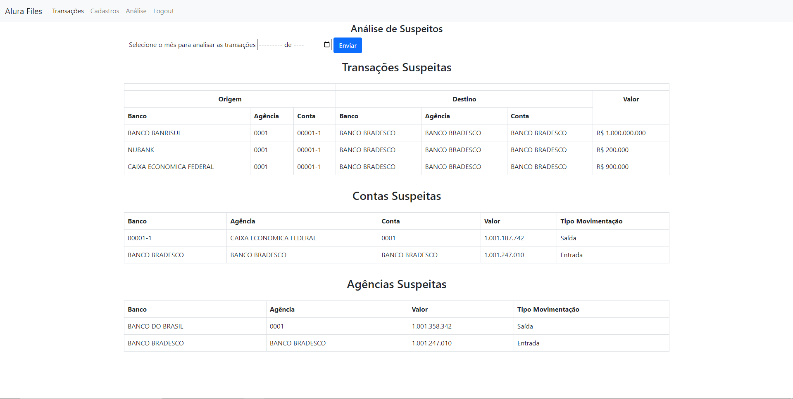

<h1 align="center"> Alura Files</h1>

## Descrição do Projeto
Esse projeto desenvolvido com python e django tem como objetivo dispinibilizar uma aplicação web, onde após realizar o login tem acesso ao upload de arquivos (.csv e .xml) com dados de transações bancárias e outras funcionalidades.

:construction: Projeto em contrução :construction:

## Funcionalidades

- Autenticação de usuários: Recebe Email e Senha para serem verificados se estão cadastrados no banco de dados;
</br> 
- Upload de Arquivos: Com o usuário logado é possivel realizar o upload de arquivos (.csv e .xml), o arquivo será verificado e se tudo estiver correto é efetuada a tranferencia dos dados do arquivo para o banco de dados;
</br> 
- Detalhes: Na lista de dados fica visivel um botão "Detalhes", este botão leva para uma página que mostra detalhes do dia da transação e o usuário que enviou os dados; 
</br> 
- Análise: Página onde exibe transações, contas e bancos suspeitos de um mês e ano selecionado pelo usuário;
</br> 
- Cadastro - 1: Página para fazer cadastro, alterar e deletar usuários;
</br> 
 - Cadastro - 1.2: Na página de cadastro o usuário preenche um formulario com nome e email, e a aplicação gera uma senha e envia para o email cadastrado;
</br>

## Demonstração das páginas

<p>Tela de Login:</p>


<p>Telas de Transações e Detalhes:</p>


<p>Telas de Cadastros:</p>


<p>Tela de Análise:</p>




## Executar o projeto

Após baixar ou clonar o repositorio, vôce pode abrir a pasta com o prompt de comando:

- Crie um ambiente virtual do python com o comando `python -m venv [nome da venv]`;
</br>
- ative o ambiente virtual com o comando: 
-- para windows `[nome da venv]\Scripts\activate`
-- para linux `[nome da venv]/bin/activate` ;
</br>
- instale as bibliotecas necessárias para rodar o projeto:
-- `pip install -r requeriments.txt`;
</br>
- altere as informações no arquivo `settings.py`:
```
DATABASES = {
        'default': {
        'ENGINE': 'django.db.backends.postgresql_psycopg2',
        'NAME': '[nome do banco de dados]',
        'USER': '[nome de usuário do postgres]',
        'PASSWORD': '[senha do usuário do postgres]',
        'HOST': '127.0.0.1',
        'PORT': '5432',
    }
}
```
altere o email e código de acesso do email para fazer o envio da senha por email (`settings.py`):
```
EMAIL_HOST_USER = '[seu email]'
EMAIL_HOST_PASSWORD = '[seu código de acesso gerado pelo gmail]'
```
</br>
- execute o comando: `python manage.py makemigrations` para criar as migrações do banco de dados;
</br>
- execute o comando: `python manage.py migrate` para salvar as alterações no banco de dados;
</br>

## Tecnologias utilizadas

- `Python 3.9.10`
- `Django 4.0.4`
- `Postgresql 14.2`

## Contato

- [Linkedin](https://www.linkedin.com/in/paulo-sergio-silva-junior-b6a72813b/)
   


